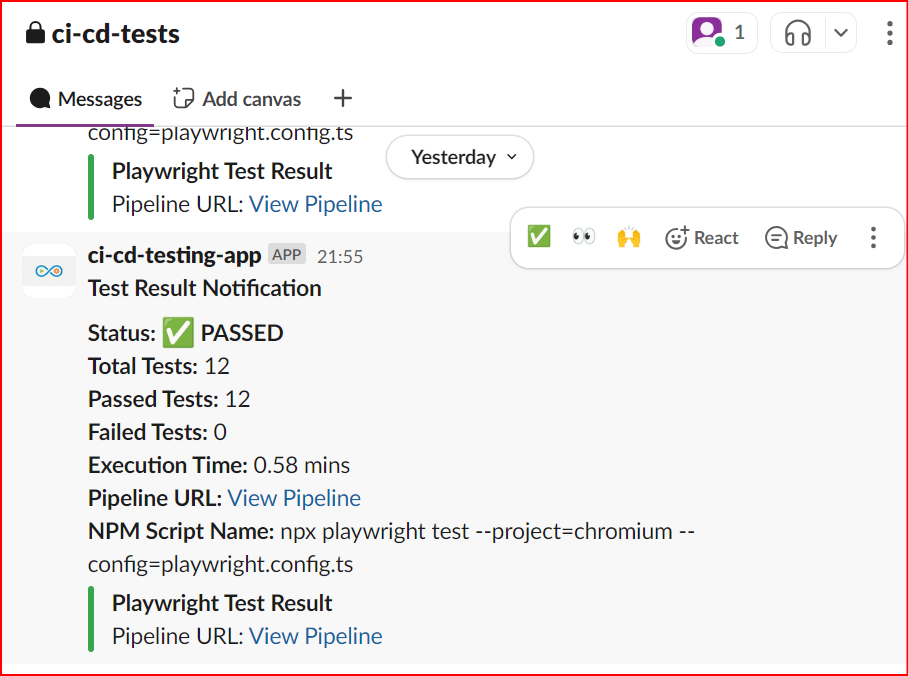

# Playwright Test Automation Framework

This repository contains a Playwright test automation framework for testing the Jupiter Toys application. The framework is written in TypeScript and follows object-oriented design principles. It includes test cases for various pages of the application, such as the contact page and the shop page.

## Prerequisites

- Node.js (version 14 or higher)
- npm (version 6 or higher)

## Installation

1. Clone the repository:
   ```sh
   git clone https://github.com/your-username/playwright-taf-jupiter.git
   cd playwright-taf-jupiter
   ```

2. Install the dependencies:
   ```sh
   npm install
   ```

## Project Structure

```
src/
  data/
    contact/
      tc01-test-data.ts
      tc02-test-data.ts
    shop/
      tc03-test-data.ts
  fixtures/
    jupiter-test.ts
    expect.ts
  models/
    testCase.ts
  pages/
    basePage.ts
    home.ts
    contact.ts
    shop.ts
    cart.ts
  tests/
    contact.tc.01.spec.ts
    contact.tc.02.NewCustomers.spec.ts
    contact.tc.02.OneCustomer.spec.ts
    shopAndCart.tc.03.spec.ts
  utils/    
    customReporter.js
    notifySlack.js
    stringUtils.ts
    test-data.ts 
playwright.config.ts
tsconfig.json
package.json
```

- **data/**: Contains test data files in TypeScript format.
- **fixtures/**: Contains custom fixtures for Playwright tests.
- **models/**: Contains TypeScript interfaces and types.
- **pages/**: Contains page object classes for different pages of the application.
- **tests/**: Contains test case files.
- **utils/**: Contains utility functions.

## Running Tests

To run the tests, use the following command:
```sh
npm run test
```

## Writing Tests

### Test Data

Test data is stored in TypeScript files in the `src/data` directory. Each test data file exports an object that conforms to the appropriate interface.

Example `tc01-test-data.ts`:
```typescript
import { ContactTestCase } from '../../models/testCase';

export const testData: ContactTestCase = {
  testId: "TC01",
  testName: "Verify error messages and populate mandatory fields",
  description: "This test case verifies the error messages for mandatory fields and populates them.",
  forename: "John",
  surname: "Doe",
  email: "john@example.com",
  telephone: "1234567890",
  message: "This is a test message",
  expectedForenameError: "Forename is required",
  expectedSurnameError: "",
  expectedEmailError: "Email is required",
  expectedTelephoneError: "",
  expectedMessageError: "Message is required"
};
```

### Test Cases

Test cases are written in TypeScript and stored in the `src/tests` directory. Each test case file imports the necessary test data and uses the Playwright test runner to define and run the tests.

Example `contact.tc.01.spec.ts`:
```typescript
import { test } from '../fixtures/jupiter-test';
import { testData } from '../data/contact/tc01-test-data';

test.describe('Contact Page Tests', () => {
  test(`${testData.testId}: ${testData.testName}`, async ({ homePage, contactPage }) => {
    await test.step('Step 1: From the home page go to contact page', async () => {
      await homePage.navigate();
      await homePage.goToContactPage();
    });

    await test.step('Step 2: Click submit button', async () => {
      await contactPage.submitForm();
    });

    await test.step('Step 3: Verify error messages', async () => {
      await contactPage.verifyErrorMessages(
        testData.expectedForenameError!,
        testData.expectedEmailError!,
        testData.expectedMessageError!
      );
    });

    await test.step('Step 4: Populate mandatory fields', async () => {
      await contactPage.fillMandatoryFields(testData.forename!, testData.email!, testData.message!, testData.telephone!);
    });

    await test.step('Step 5: Validate errors are gone', async () => {
      await contactPage.validateErrorsAreGone();
    });
  });
});
```

### Custom Fixtures

Custom fixtures are defined in the `src/fixtures/jupiter-test.ts` file. These fixtures extend the base Playwright test object to include custom page objects.

Example `jupiter-test.ts`:
```typescript
import { test as baseTest } from '@playwright/test';
import { HomePage } from '../pages/home';
import { ContactPage } from '../pages/contact';
import { ShopPage } from '../pages/shop';

type JupiterToys = {
  homePage: HomePage;
  contactPage: ContactPage;
  shopPage: ShopPage;
};

export const test = baseTest.extend<JupiterToys>({
  homePage: async ({ page }, use) => {
    await use(new HomePage(page));
  },
  contactPage: async ({ page }, use) => {
    await use(new ContactPage(page));
  },
  shopPage: async ({ page }, use) => {
    await use(new ShopPage(page));
  },
});

export { expect } from '@playwright/test';
```

## Continuous Integration

To execute the tests within a continuous pipeline, you can set up GitHub Actions. Here is an example workflow file:

### GitHub Actions Workflow (`.github/workflows/ci-pipeline.yml`)


## Slack notification

When tests are executed via Continuous Integration (e.g., GitHub Actions), a job will send a notification to a specified Slack channel with the test results and a link to the job. This helps keep the team informed about the status of the test runs and any issues that need attention.


